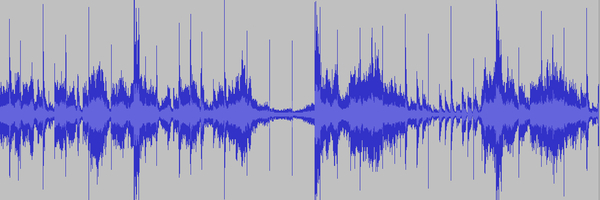
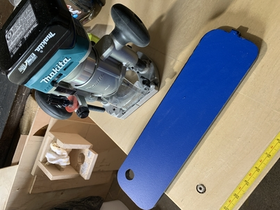
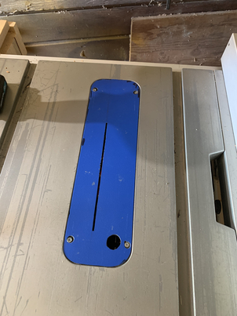
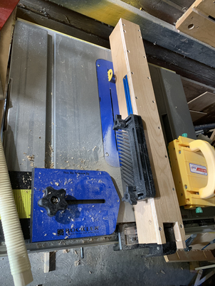

### Soundwave Art

## About the piece

The scope of this project was to create a large wooden piece to be hung on a wall. The piece was to be of specific dimensions (3' x 6') and to include a specific line/phrase captured as a soundwave.

## Materials & Tools

#### Part I
I researched the best wood for the project and decided to use Alder for several reasons:

- Alder (Latin: *Alnus Rubra*) has a native distribution in the Pacific Northwest, where the piece would be displayed.
- It is easily worked with (cutting, sanding, staining)
- The wood itself is strong and considered a soft hardwood species but is overall not as dense/heavy as other hardwoods (maple, oak, cherry, etc) which was a concern given that the piece would be hung on a wall.

For all coloring - the main panel stain as well as the gradient on the soundwave - I used various combinations of MIXOL® diluted using denatured alcohol.

I was able to capture the audio and isolate the particular sounds needed using the free, open-source audio software, [Audacity®](https://www.audacityteam.org/).

<figure>
  
  <figcaption> This is the visual depiction of the soundwave.</figcaption>
</figure>

With the sound isolated, I then used [GIMP](https://www.gimp.org/) (GNU Image Manupulation Program) to take a visual snapshot of the soundwave that I could use as a template for the finished product (exporting the file as a .PNG file). My local office supply retailer had large-scale printing abilities and was able to print the file out at the needed overall dimensions (scaled up for a 3'x 6' final size).

In order to cut the thin strips needed to create the soundwave, a zero-clearance insert for the table saw was needed (one was not available that fit my model of saw, so I built one using a 1/2" piece of phenolic resin material and a router).

A second mechanism was needed to enable the 4" alder stock to be able to fit snuggly against the table saw for each pass with the zero-clearance insert to ensure safe and consistent results in cutting thin strips. This was accomplished by building a cover that fit on top of the saw's existing adjustable fence which uses a T-track and adjustable hold-down mechanism to apply direct vertical pressure to the stock as it is fed through the blade, while a horizontal depth guage provided consistent pressure along the horizontal axis to help guide the stock.

    

      
      
      
    

  

<!-- <table class="projTable">
  <tbody>
    <tr>
      <td class="carpentryProjImages">
        <figure>
          
        <figcaption>Zero clearance saw insert mid-build.</figcaption>
        </figure>
      </td>
      <td class="carpentryProjImages">
        <figure>
          
        <figcaption>Zero-clearance saw insert finished.</figcaption>
        </figure>
      </td>
      <td class="carpentryProjImages">
        <figure>
          
        <figcaption>Jig to hold wood against saw blade.</figcaption>
      </figure>
      </td>
    </tr>
  </tbody>
  </table> -->

## Project Build

#### Part II
The piece was built in stages to allow for proper drying of the glue-ups at each stage with the large panels being cut to size and glued up first to create the base for the entire project. When the base had dried, it was then leveled by hand using a bench plane to take out any high spots and patched any cracks/holes and sanded with a random orbital sander from 150 - 400 grit to get a fine, smooth surface for stain application.

#### Part III
Strips were cut using the saw fence jig to create numerous thin (1/8") strips of the stock and then to lay out the large scale soundwave image print over the base panels. With the template on the base, the thin strips were measured following the template one-by-one until a section of approximately 9" was completed. Each section would then be glued-up using a fast-setting glue, and left to dry while more sections were started. This process continued until the entire soundwave was completed. When all sections had dried, any holes or imperfections were patched and the sections were all sanded using 150 - 400 grit sandpaper.

  

    

      
      
      
    

  

#### Part IV

While the soundwave sections cured, the main base was stained and finished using a polycrylic protective sealer. The sections were then aligned and afixed to the base using wood glue and brad nails (to hold the sections in place better while the glue set). The holes from the nails were filled with wood putty and sanded to prepared for staining.

  

    

      
      
      
      
    

  

#### Part V

To achieve a color gradient, the sections were stained first in the most prominent colors (purple, orange, yellow) and then the colors were overlayed with diluted amounts of denatured alcohol after each application to allow for them to "bleed-in" to one another more easily. A Final layer of polycrylic protective sealer was applied to the entire piece to seal all parts. Once everything had dried, it was buffed by hand with scotchbrite pads to acheive a glossy appearance.